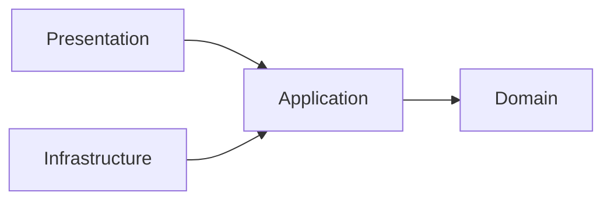

# Arquitetura do FinControl

Este repositório publica uma amostra segura da arquitetura usada no projeto privado FinControl.

## Organização por feature

O projeto adota uma arquitetura orientada a funcionalidades. Cada contexto de negócio mantém suas próprias regras e contratos, reduzindo acoplamento entre módulos.

```text
src/features/
└── financial-analytics/
    ├── domain/
    │   ├── services/
    │   ├── types/
    │   └── value-objects/
    ├── application/
    ├── infrastructure/
    ├── presentation/
    └── tests/
```

## Clean Architecture leve

As dependências seguem a direção das regras de negócio:



### Domain

Contém regras puras, sem dependência de Next.js, React ou Supabase. Exemplos publicados neste showcase:

- `CivilDate` para validar datas civis canônicas;
- cálculo de calendário gregoriano;
- resolução de períodos financeiros;
- verificação de pertencimento a intervalos semiabertos;
- agregação da evolução financeira usando inteiros em centavos.

### Application

No projeto completo, coordena casos de uso e portas de acesso a dados. O domínio permanece utilizável sem conhecer detalhes do framework.

### Infrastructure

Implementa integrações concretas, como persistência e consultas com Supabase. Essas implementações ficam fora das regras centrais de negócio.

### Presentation

Responsável pela interface Next.js/React e pela composição dos dados para o usuário.

## Decisões técnicas demonstradas

- dinheiro representado como inteiro em centavos;
- intervalos de datas no formato `[início, fim)` para evitar ambiguidades;
- validação explícita de datas gregorianas e anos bissextos;
- validação de `Number.isSafeInteger` em cálculos financeiros;
- regras de domínio testáveis sem infraestrutura;
- separação entre contratos, regra de negócio e integração externa.

## Segurança arquitetural

Este showcase não contém credenciais, dados de usuários, configurações reais de ambiente, logs locais ou artefatos de ferramentas de desenvolvimento. O objetivo é demonstrar capacidade técnica sem publicar material sensível do produto completo.
