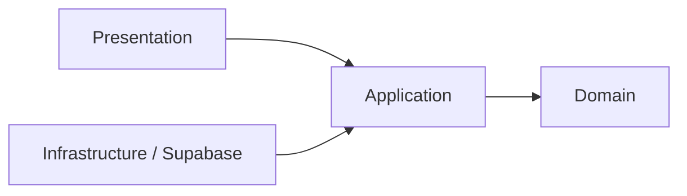

# FinControl Showcase

> Versão pública e sanitizada do FinControl para portfólio técnico. O repositório principal de desenvolvimento (`fin_control`) permanece privado e intacto.

## Visão geral

O FinControl é uma PWA de finanças pessoais criada para transformar lançamentos financeiros em informações úteis para tomada de decisão. A aplicação trabalha com receitas, despesas, contas, períodos financeiros, evolução de saldo e arquitetura preparada para análises assistidas por IA.

Este showcase publica somente material seguro para demonstração profissional. Histórico Git antigo, credenciais, dados financeiros, arquivos locais, logs, anexos do Codex e documentação operacional interna não são transportados para cá.

## O que está público neste repositório

- configuração segura de variáveis por `.env.example`;
- `.gitignore` reforçado para impedir publicação acidental de segredos e artefatos locais;
- manifesto técnico do projeto;
- amostra real da camada de domínio de `financial-analytics`;
- value object de data civil e regras de calendário gregoriano;
- agregação de evolução financeira usando valores monetários em centavos e validação de inteiros seguros.

A seleção de código é derivada da base privada atual, mas publicada aqui sem o histórico antigo e sem conteúdo operacional que não seja necessário para avaliação técnica.

## Funcionalidades do produto

- cadastro de receitas e despesas;
- resumo mensal e dashboard financeiro;
- contas financeiras isoladas por usuário;
- autenticação e proteção de rotas;
- períodos semanais, móveis, quinzenais e mensais;
- evolução financeira e indicadores;
- experiência PWA mobile-first;
- arquitetura preparada para importação de extratos e IA.

## Tecnologias

`Next.js 16` · `React 19` · `TypeScript` · `Tailwind CSS` · `Supabase` · `Zod` · `Jest` · `Testing Library`

## Arquitetura

O projeto utiliza Feature-Based Architecture com Clean Architecture leve. As regras de domínio permanecem independentes do framework; apresentação, aplicação e infraestrutura são mantidas em fronteiras separadas.



Exemplo publicado:

```text
src/features/financial-analytics/
└── domain/
    ├── services/
    │   ├── aggregate-financial-evolution.ts
    │   └── gregorian-calendar.ts
    ├── types/
    │   ├── financial-evolution.types.ts
    │   └── financial-period.types.ts
    └── value-objects/
        └── civil-date.ts
```

## Qualidade e segurança

O fluxo de engenharia do projeto utiliza TDD, lint, type-check, testes automatizados, auditoria de dependências e build como quality gates.

No showcase público:

- `.env`, `.env.local` e variações permanecem ignorados;
- `.env.example` contém somente nomes de variáveis, sem valores reais;
- `.codex/`, `.codex-remote-attachments/`, `.vercel/`, logs e artefatos locais são ignorados;
- nenhuma `SUPABASE_SERVICE_ROLE_KEY`, senha ou token real é publicado;
- valores monetários demonstrados no domínio são tratados como inteiros em centavos.

## Repositório privado x showcase

O desenvolvimento completo continua no repositório privado. Este repositório existe para permitir que recrutadores e profissionais de tecnologia avaliem organização, modelagem de domínio, padrões de código, segurança e decisões arquiteturais sem expor informações sensíveis ou material operacional desnecessário.

## Autor

Desenvolvido por [Amauri Daliessi Junior](https://github.com/JrDaliessi).
