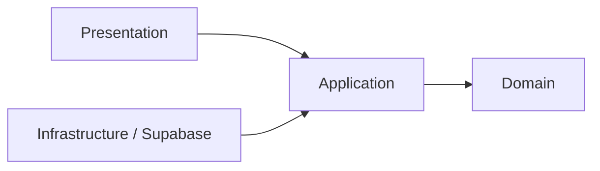

# FinControl Showcase

> Versão pública e sanitizada do FinControl para portfólio técnico. O repositório principal de desenvolvimento (`fin_control`) permanece privado e intacto.

## Visão geral

O FinControl é uma PWA de finanças pessoais criada para transformar lançamentos financeiros em informações úteis para tomada de decisão. A aplicação trabalha com receitas, despesas, contas, períodos financeiros, evolução de saldo e arquitetura preparada para análises assistidas por IA.

Este showcase publica somente material seguro para demonstração profissional. Histórico Git antigo, credenciais, dados financeiros, arquivos locais, logs, anexos do Codex e documentação operacional interna não são transportados para cá.

## O que este projeto demonstra tecnicamente

- modelagem de domínio financeiro com regras independentes do framework;
- Feature-Based Architecture com Clean Architecture leve;
- uso de TypeScript estrito e contratos explícitos;
- valores monetários tratados como inteiros em centavos;
- períodos financeiros semanais, móveis, quinzenais e mensais;
- intervalos de datas no formato `[início, fim)`;
- validação de datas civis, anos bissextos e viradas de calendário;
- prevenção de overflow com `Number.isSafeInteger`;
- TDD e testes automatizados para regras de negócio;
- isolamento de infraestrutura, apresentação e domínio;
- preocupação prática com segurança de secrets e dados sensíveis.

## Funcionalidades do produto

- cadastro de receitas e despesas;
- resumo mensal e dashboard financeiro;
- contas financeiras isoladas por usuário;
- autenticação e proteção de rotas;
- períodos semanais, móveis, quinzenais e mensais;
- evolução financeira e indicadores;
- experiência PWA mobile-first;
- arquitetura preparada para importação de extratos e IA.

## Tecnologias

`Next.js 16` · `React 19` · `TypeScript` · `Tailwind CSS` · `Supabase` · `Zod` · `Jest` · `Testing Library`

## Arquitetura

O projeto utiliza Feature-Based Architecture com Clean Architecture leve. As regras de domínio permanecem independentes do framework; apresentação, aplicação e infraestrutura são mantidas em fronteiras separadas.



Amostra pública:

```text
src/features/financial-analytics/
├── domain/
│   ├── services/
│   │   ├── aggregate-financial-evolution.ts
│   │   ├── contains-civil-date.ts
│   │   ├── gregorian-calendar.ts
│   │   └── resolve-financial-period.ts
│   ├── types/
│   │   ├── financial-evolution.types.ts
│   │   └── financial-period.types.ts
│   └── value-objects/
│       └── civil-date.ts
└── tests/
    └── resolve-financial-period.test.ts
```

Mais detalhes: [ARCHITECTURE.md](./ARCHITECTURE.md)

## Qualidade e testes

O fluxo de engenharia do projeto utiliza TDD, lint, type-check, testes automatizados, auditoria de dependências e build como quality gates.

A amostra pública demonstra testes determinísticos para períodos financeiros, fronteiras de datas e regras de calendário. O projeto privado também possui testes de componentes, integração com repositórios, contratos de banco e políticas RLS.

Mais detalhes: [TESTING.md](./TESTING.md)

## Segurança

No showcase público:

- `.env`, `.env.local` e variações permanecem ignorados;
- `.env.example` contém somente nomes de variáveis, sem valores reais;
- `.codex/`, `.codex-remote-attachments/`, `.vercel/`, logs e artefatos locais são ignorados;
- nenhuma `SUPABASE_SERVICE_ROLE_KEY`, senha ou token real é publicado;
- dados financeiros reais e identificadores de usuários não fazem parte da amostra pública.

Consulte também [SECURITY.md](./SECURITY.md).

## Repositório privado x showcase

O desenvolvimento completo continua no repositório privado. Este repositório existe para permitir que recrutadores e profissionais de tecnologia avaliem organização, modelagem de domínio, padrões de código, segurança, testes e decisões arquiteturais sem expor informações sensíveis ou material operacional desnecessário.

## Para recrutadores

Este projeto evidencia competências aplicáveis a vagas de desenvolvimento, análise de sistemas e qualidade de software: decomposição de requisitos, modelagem de domínio, testes automatizados, segurança, organização arquitetural, Git/GitHub e evolução incremental de produto.

## Autor

Desenvolvido por [Amauri Daliessi Junior](https://github.com/JrDaliessi).
