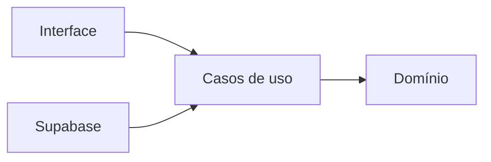

# FinControl

> Estudo de caso público de uma PWA de finanças pessoais. O código-fonte completo permanece privado por conter regras de produto em desenvolvimento.

## Visão geral

O FinControl foi pensado para transformar lançamentos financeiros em informações úteis para tomada de decisão. A aplicação reúne receitas, despesas, contas e resumos mensais em uma experiência mobile-first, com evolução planejada para importação de extratos e análises assistidas por IA.

## Problema resolvido

Planilhas e aplicativos genéricos registram valores, mas nem sempre explicam hábitos, riscos ou evolução financeira. O FinControl organiza esses dados em uma visão consolidada e prepara uma base segura para análises inteligentes.

## Funcionalidades

- cadastro de receitas e despesas;
- resumo mensal e dashboard financeiro;
- contas financeiras isoladas por usuário;
- autenticação e proteção de rotas;
- experiência PWA mobile-first;
- arquitetura preparada para importação de extratos e IA.

## Tecnologias

`Next.js 16` · `React 19` · `TypeScript` · `Tailwind CSS` · `Supabase` · `Zod` · `Jest` · `Testing Library`

## Arquitetura e qualidade

O projeto segue Feature-Based Architecture com Clean Architecture leve. As regras de domínio não dependem do framework, enquanto Supabase e interface ficam isolados em suas respectivas camadas. O fluxo de entrega utiliza TDD, lint, verificação de tipos, testes automatizados e build como quality gates.

## Segurança

- Row Level Security para isolamento por usuário;
- sessões verificadas e rotas privadas;
- segredos mantidos fora do repositório;
- nenhuma movimentação financeira autônoma.

## Status

Em desenvolvimento ativo. Este repositório apresenta decisões, escopo e competências técnicas sem expor credenciais, dados financeiros ou código proprietário.

## Autor

Desenvolvido por [Amauri Daliessi Junior](https://github.com/JrDaliessi).
